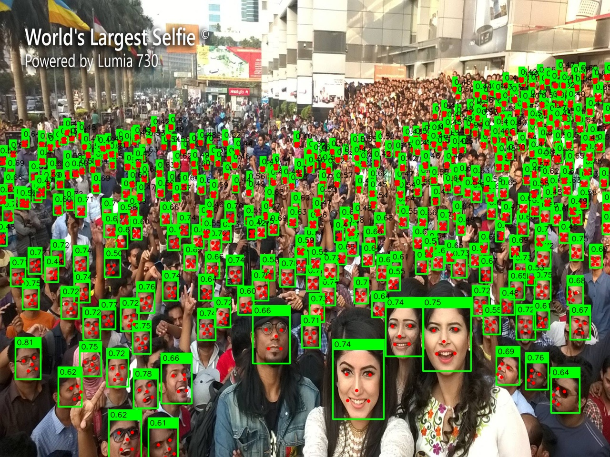

# Overview
The objective of this project is to run the DBFace, a real-time, single-stage face detector on Intel(r) Distribution of OpenVINO(tm) Toolkit.  
**Original DBFace GitHub site:**
https://github.com/dlunion/DBFace

Thie original developer used PyTorch to train the model. You need to convert the PyTorch model to OpenVINO IR model. You need to run 2 convertion steps to get the final IR model.  
```sh
  PyTorch (.pth) -> ONNX (.onnx) -> IR (.xml, .bin)
```

このプロジェクトの目的はリアルタイムでシングルステージの顔検出モデル、DBFaceをIntel(r) Distribution of OpenVINO(tm) Toolkit上で実行できるようにすることです。  
**Original DBFace GitHub site:**
https://github.com/dlunion/DBFace

元の開発者はPyTorchを使ってモデルの学習を行っています。そのためPyTorchモデルからOpenVINO IRモデルへの変換を行わなくてはなりません。 IRモデルを得るためには２つの変換ステップを要します。
```sh
  PyTorch (.pth) -> ONNX (.onnx) -> IR (.xml, .bin)
```

**Detection result with a 4VGA (1280x960) input picture**


## 1. Prerequisites
* [Intel Distribution of OpenVINO toolkit 2020.2 (or newer)](https://software.intel.com/content/www/us/en/develop/tools/openvino-toolkit.html)
* Model Downloader / Model Converter setup  
  [Model Downloader guide](https://docs.openvinotoolkit.org/latest/_tools_downloader_README.html)
```sh
pip3 -r <openvino>/deployment_tools/tools/model_downloader/requirements.in
pip3 -r <openvino>/deployment_tools/tools/model_downloader/requirements-pytorch.in
```
If you fail to install PyTorch, go to PyTorch official web site and follow the `QUICK START LOCALLY` guide to install it. You need to have PyTorch >=1.4.

## 2. Download DBFace PyTorch model
Download `dbface.pth` from [original developer's GitHub page](https://github.com/dlunion/DBFace/tree/master/model).

## 3. Convert PyTorch model into ONNX model

Use `pytorch_to_onnx.py` in the `model_downloader` directory.
```sh
python3 ${INTEL_OPENVINO_DIR}/deployment_tools/tools/model_downloader/pytorch_to_onnx.py \
 --model-name DBFace \
 --weights dbface.pth \
 --import-module DBFace \
 --input-shape 1,3,320,320 \
 --output-file dbface.onnx \
 --input-names x \
 --output-names sigmoid_hm,tlrb,landmark
```
**Hint:** You can get the input and output node names from the model source code (in this case, `DBFace.py` in the `model` directory)
```Python
    def forward(self, x):
        out = self.hs1(self.bn1(self.conv1(x)))
          :
        return sigmoid_hm, tlrb, landmark
```
## 4. Convert ONNX model into OpenVINO IR model

Use `Model Optimizer (MO)` to convert the ONNX model into IR model.

```sh
python3 ${INTEL_OPENVINO_DIR}/IntelSWTools/openvino/deployment_tools/model_optimizer/mo.py \
 --input_model dbface.onnx \
 --mean_values [180,154,150] \
 --scale_values [73.7,70.0,70.9] \
 --input_shape [1,3,960,1280] \
 --output_dir dbface-4vga \
 --data_type FP16
```

**Hint:** You can change the input shape with `--input_shape` option.  
**Hint:** You can find the appropriate parameters (`--mean_values` and `--scale_values`) for input data preprocessing from the original source code (in this case, line 36-40 in `main.py` from the origianl GitHub site)
```Python
    mean = [0.408, 0.447, 0.47]
    std = [0.289, 0.274, 0.278]

    image = common.pad(image)
    image = ((image / 255.0 - mean) / std).astype(np.float32)
```

## 5. Run sample program

```sh
python3 dbface.py -m model.xml -i input_image
  or
python3 dbface-cam.py -m model.xml  (webCam version)
```
`output.jpg` will be ganarated in the current directry. (non-webCam version only)  


## 6. Test Environment
- Ubuntu 18.04 / Windows 10 1909  
- OpenVINO 2020.3 LTS  


## See Also  
* [GitHub, dlunion/DBFace](https://github.com/dlunion/DBFace)
* [Intel(r) Distribution of OpenVINO(tm) Toolkit](https://software.intel.com/content/www/us/en/develop/tools/openvino-toolkit.html)
* [Converting a ONNX* Model](https://docs.openvinotoolkit.org/latest/_docs_MO_DG_prepare_model_convert_model_Convert_Model_From_ONNX.html)
* [Model Downloader and other automation tools](https://docs.openvinotoolkit.org/latest/_tools_downloader_README.html)
* [PyTorch official web page](https://pytorch.org/?utm_source=Google&utm_medium=PaidSearch&utm_campaign=%2A%2ALP+-+TM+-+General+-+HV+-+JP&utm_adgroup=Installing+PyTorch&utm_keyword=installing%20pytorch&utm_offering=AI&utm_Product=PyTorch&gclid=Cj0KCQjwudb3BRC9ARIsAEa-vUvjBVIyGnP31gCk__x1bquCw5HNX3Av0Mu0vwU75HBxgT79lCdwsuUaAoUFEALw_wcB)
